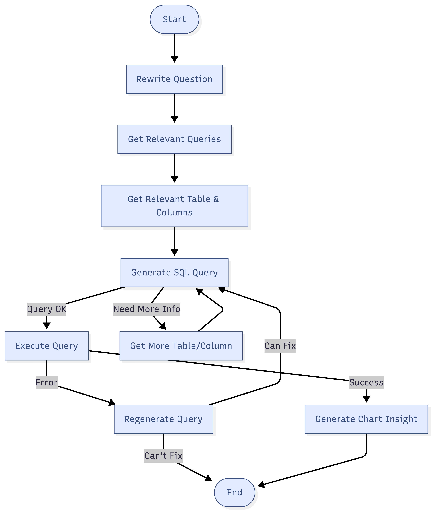
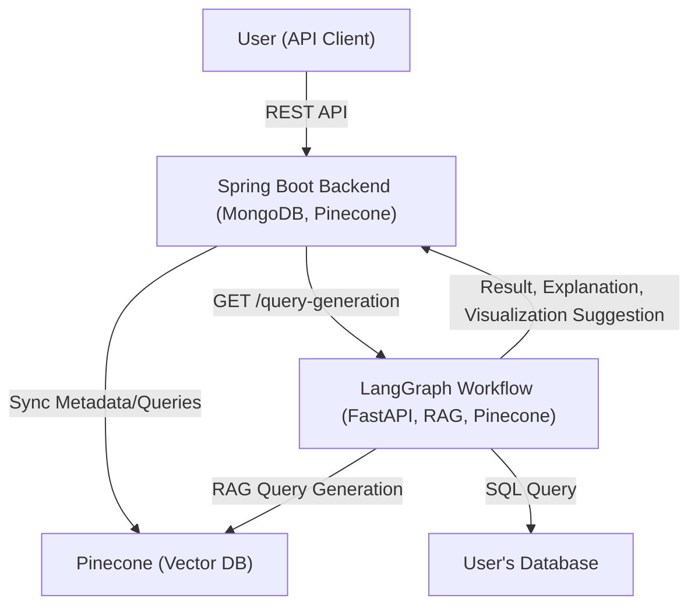

# Insight-Copilot 🚀

**Insight-Copilot** is a backend-only platform that enables users to interact with their databases using natural language queries. It leverages AI-driven workflows to generate SQL queries, provide execution results, explain query logic, and suggest suitable data visualizations. The system is designed for extensibility and integrates a Retrieval-Augmented Generation (RAG) system using Pinecone as a vector database.

---

## ✨ Features

### 🛠️ Spring Boot Backend (MongoDB)
- 👤 **User Management**: Create, update, and delete user accounts with basic authentication.
- 🗄️ **Database Configuration**: Add, update, and delete database connection settings.
- 📊 **Table & Column Metadata**: Manage metadata for tables and columns in your databases.
- 💡 **Example Queries**: Store, update, and delete example queries for reference and RAG.
- 💬 **Chat with Database**: Interact with your database using natural language; view chat history.
- 🔗 **Pinecone Integration**: All metadata and example queries are synchronized with Pinecone for enhanced AI-driven query generation.

### 🤖 LangGraph SQL Generation Workflow (FastAPI)
- 📝 **Query Generation**: Receives requests from the Spring Boot backend to generate SQL queries using AI.
- 🧠 **Result Explanation**: Returns not only the query and its execution result, but also a detailed explanation of the query logic.
- 📈 **Visualization Suggestions**: Suggests the most suitable type of data visualization for the query result, including recommended X and Y axes.
- 🌐 **API-First**: Exposes endpoints via FastAPI for seamless integration with the Spring Boot backend.

### 🤖 LangGraph SQL Generation Workflow Architecture


---

## 🏗️ Architecture



---

## 🚀 Getting Started

### 📋 Prerequisites

- ☕ Java 17+ (for Spring Boot backend)
- 🐍 Python 3.9+ (for LangGraph workflow)
- 🍃 MongoDB instance
- 🟩 Pinecone account and API key
- 🗄️ (Optional) User's own SQL database for querying

### ⚙️ Setup

#### 1️⃣ Clone the Repository

```bash
git clone https://github.com/yourusername/Insight-Copilot.git
cd Insight-Copilot
```

#### 2️⃣ Configure Environment

- 🔑 Set up MongoDB and Pinecone credentials as environment variables or in the respective config files.
- 🛠️ Configure database connection details as needed for your use case.

#### 3️⃣ Start the Spring Boot Backend

```bash
cd Backend
./mvnw spring-boot:run
```

#### 4️⃣ Start the LangGraph Workflow (FastAPI)

```bash
cd Langgraph_SQLgeneration_workflow
pip install -r requirements.txt
uvicorn app.main:app --reload
```

---

## 🧑‍💻 Usage

1. 👤 **User Management**: Use the Spring Boot backend API to create, update, or delete user accounts.
2. 🗄️ **Database Setup**: Add your database configuration via the backend API.
3. 📊 **Metadata Management**: Add, update, or delete table and column metadata, and example queries.
4. 💬 **Chat with Database**: Send natural language queries to the backend. The backend will:
    - 🔄 Forward the request to the LangGraph FastAPI service.
    - 📥 Receive the generated SQL, execution result, explanation, and visualization suggestion.
    - 📤 Return the complete response to the user.
5. 🔗 **Pinecone Sync**: All metadata and example queries are automatically synchronized with Pinecone for RAG-powered query generation.

---

## 📡 API Overview

- 🛠️ **Spring Boot Backend**: Handles user, database, metadata, and chat management.
- 🤖 **LangGraph FastAPI**: Handles AI-powered SQL generation and explanations.
- 🔗 **Communication**: The backend sends GET requests to the LangGraph API for query generation.

---

## 🧰 Tech Stack

- ☕ **Java 17+, Spring Boot** (Backend, MongoDB, Pinecone integration)
- 🐍 **Python 3.9+, FastAPI, LangGraph** (AI workflow, RAG, Pinecone)
- 🍃 **MongoDB** (User and metadata storage)
- 🟩 **Pinecone** (Vector database for RAG)
- 🚫 **No frontend** (API-only architecture)

---

## ⚙️ Configuration

- 🔑 Ensure all required environment variables and configuration files are set up for MongoDB, Pinecone, and your database connections.
- 🛠️ Adjust application properties as needed for your environment.

---
